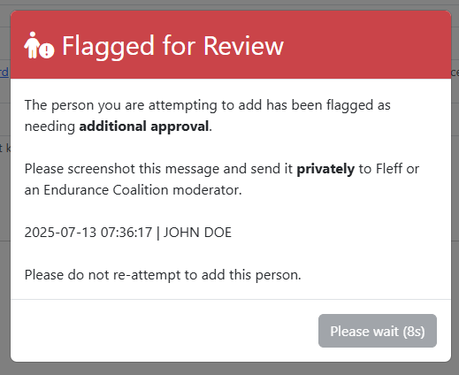

# Flagged Persons

<figure>
    
    <figcaption>The flagged person alert as of v1.2.0.</figcaption>
</figure>

*Flagged persons* is a utility introduced in `v1.2.0` which
 blocks attempts to add members based on name, Discord ID, or Steam ID. Blocked identifiers are stored on a private database table.

Flagging a person is done by EnduraNet's maintainer and Endurance Coalition staff. The reason for someone being flagged can vary. Some may be flagged for egregious behavior and so the utility ensures they never join. Others may be flagged simply because a specific staff member wants to be the one to add them.

Generally speaking, the reason as to why any individual person is flagged is confidential.

Attempts to add a flagged person will result in an alert being displayed similar to what is shown above. Simply follow it's instructions and move on.