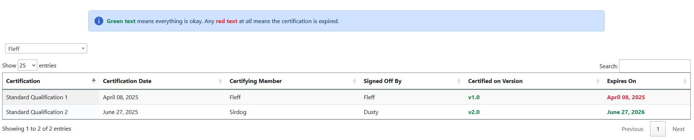

> 🌐 *Anyone can perform this action.*

!!! note
    It is planned in a future release to move away from color identification to a column explicitly stating the status.

<figure>
    
    <figcaption>Result of "By Member" search as of v1.2.0.</figcaption>
</figure>

To see the certification status of a member click the `Search...` dropdown and select either `By Member` or `By Certification`. 

On either page the thing to look out for will be 2 columns:

- Certified on Version
- Expires On

*Both* columns must have green (🟩) text in order for the certification to be valid. If *any* column is red (🟥) that means the certification is *no longer valid* and the member should be treated as not having it.