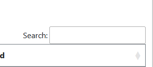

> 🌐 *Anyone can perform this action.*

<figure>
    
    <figcaption>A Datatables search bar.</figcaption>
</figure>

Searching for a certification can be done at the *Certifications* tab. Use the search bar at the top-right of the table. It can search for information on any column.