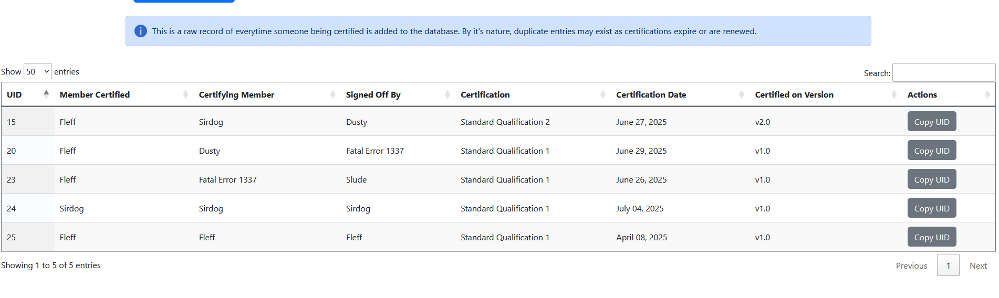

> 🌐 *Anyone can perform this action.*

!!! info
    The *Certification History* tab will **not** clearly display whether a record results in the certification being valid or invalid for the member. See [Check Certification Status](check-cert-status.md) to do that.

<figure>
    
    <figcaption>The certification history tab as of v1.2.0. Note the search bar at the top right of the table.</figcaption>
</figure>

Searching someone's certification history can be done at the *Certification History* tab. The search bar can find information on any column. 

The **UID** column to the far left is the unique database identifier of the record in question. This is used to select records for [editing](edit-history.md) or [deletion](delete-history.md). Clicking the "Copy UID" button in the far right column will quickly copy the number to your clipboard.