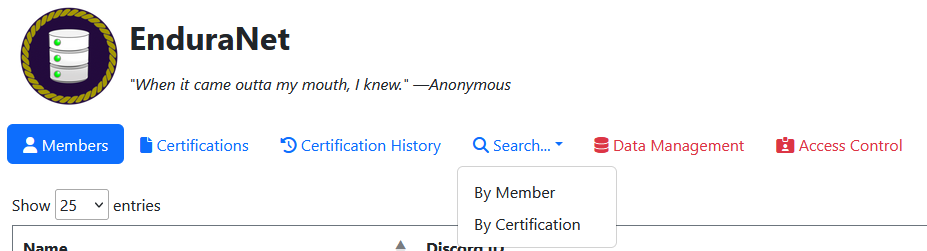

<figure>
    
    <figcaption>Fully exposed navigation bar for a logged in administrator as of v1.2.0.</figcaption>
</figure>

Navigation of the site is done primarily through the header underneath the logo and EnduraNet title.

- <abbr title="Anyone">🌐</abbr> `Members` provides a paginated table of all members EnduraNet is aware of.
- <abbr title="Anyone">🌐</abbr> `Certifications` provides a paginated table of all certifications.
- <abbr title="Anyone">🌐</abbr> `Certification History` provides a raw paginated table of every time any member has been certified on something.
- <abbr title="Anyone">🌐</abbr> `Search` provides a dropdown between 2 different pages.
    - `By Member` leads to a page where the user can select a member and get a paginated table of every certification they've ever taken and whether it's valid.
    - `By Certification` leads to a page where the user can select a certification and get a paginated table of every member that's taken it and whether it's valid.
- <abbr title="Logged-In User Only">🔑</abbr> `Data Management` leads to a hub page that shows buttons to access the input forms to add, edit, and delete data.
-  <abbr title="Administrator Only">🛡️</abbr> `Access Management` leads to the permissions adjustment interface.